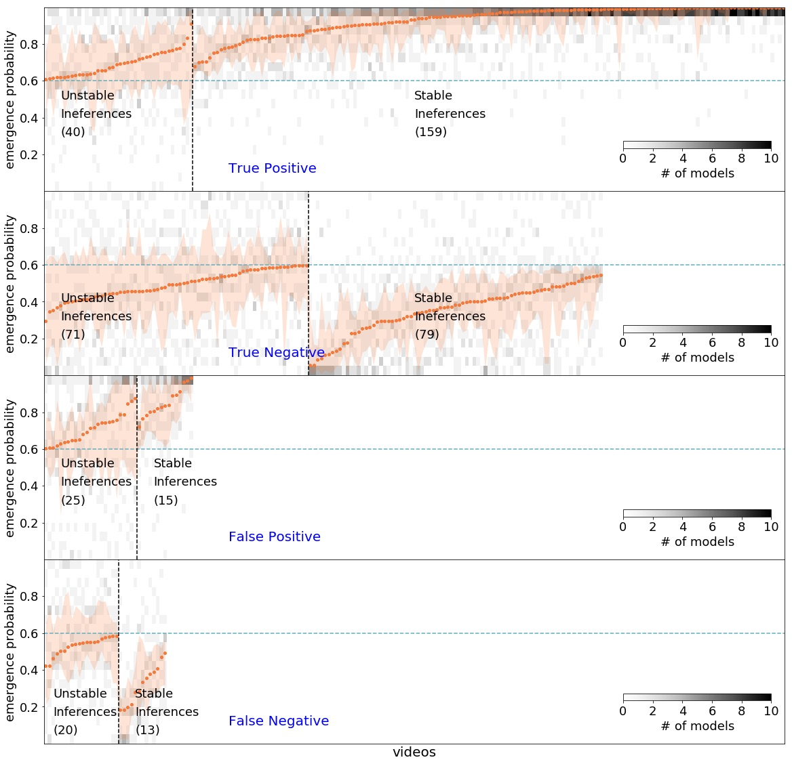

# Human-efficient labeling of a solar flux emergence video dataset by a deep learning model
Code from our article 'Human-efficient labeling of a solar flux emergence video dataset by a deep learning model' to create model-ensemble through training-validation combination and dropouts.

Evaluated uncertainty on test set using model-ensemble is shown below-

  

Using model ensemble we also identify epoch of emergence as below (look for blue to red transition)-

### Requirements
Below are the package versions used in writing the code. 

Python 3.7.10

tensorflow                                                            
'1.15.2'

keras                                                             
'2.2.4-tf'

matplotlib                                                      
'3.2.2'

numpy  
'1.19.5'

cv2
'4.1.2'

csv
'1.0'
